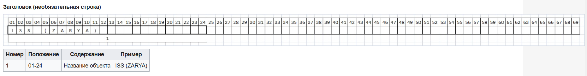
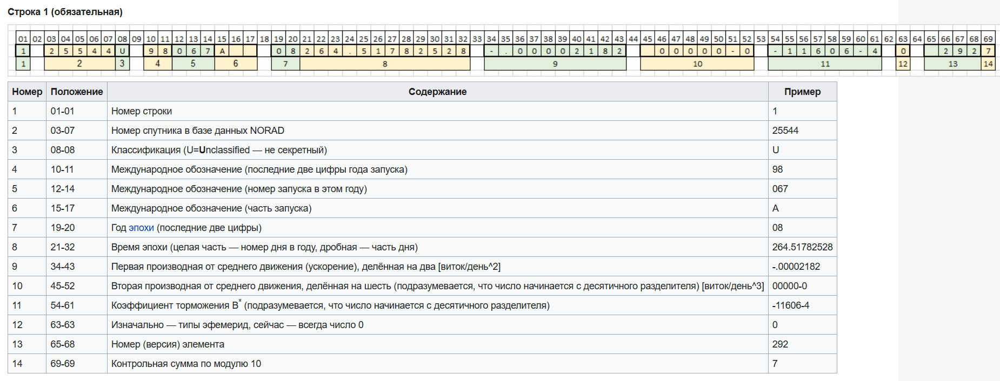
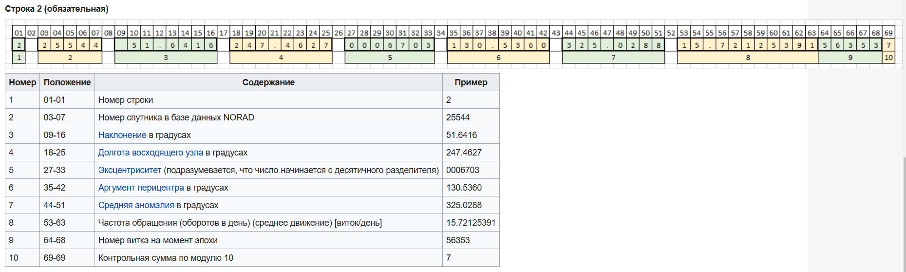

# Satellites/Спутники

## **📁 Структура репозитория**

Репозиторий организован следующим образом:

```log
.
├── src/
│ ├── UI/ # Папка с файлами окон программы
│ ├── Utils/ # Папка с необходимыми утилитами для обработки информации
│ └── main.cpp # Главный файл программы 
├── resources/
│ ├── examples/ # Примеры TLE файлов для проверки и тестирования
│ ├── icons/ # Иконки программы, действий, кнопок
│ ├── images/ # Картинки, скриншоты для README.md
│ ├── report/ # Отчёт 3343_Коршков_АА в формате .docx и .pdf
│ ├── task/ # Задание
│ └──mainwindow.qrc # Файл с ресурсами для приложения
├── .gitignore # Gitignore файл
├── CMakeLists.txt # Cmake файл для сборки проекта
├── Doxyfile # Конфигурационный файл для генерации документации Doxygen
├── LICENSE # Файл с лицензией
└── README.md # Этот файл
```

## **▶️Как собрать и запустить?**

В РАЗРАБОТКЕ...

Данный проект писался под `Windows/Linux`.

На `Windows` используется компилятор MinGW под архитектуру UCRT64.

На `Linux` используется GCC/GDB.

Для сборки необходимо установить следующие модули:

**Для `Windows` (MSYS2):**
```
pacman -S mingw-w64-ucrt-x86_64-qt6
```

## 🖼️ Скриншоты приложения
В РАЗРАБОТКЕ...

## **🧠 Теоретическая часть**

Данные были взяты из [русскоязычной](https://ru.wikipedia.org/wiki/TLE) и [англоязычной](https://en.wikipedia.org/wiki/Two-line_element_set) википедии.

**TLE** (аббр. от англ. two-line element set, двухстрочный набор элементов) — двухстрочный формат данных, представляющий собой набор элементов орбиты для спутника Земли.

**Структура данного формата:**

1. **Заголовок**


1. **Первая строка**


1. **Вторая строка**

