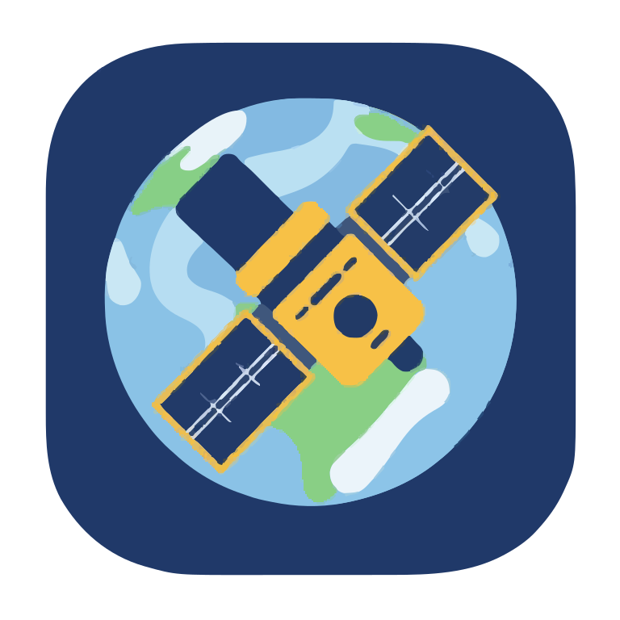

# Спутники/Satellites

<div align="center"></div>

## **📁 Структура репозитория**

Репозиторий организован следующим образом:

```log
.
├── src/
│ ├── UI/ # Папка с файлами окон программы
│ ├── Utils/ # Папка с необходимыми утилитами для обработки информации
│ └── main.cpp # Главный файл программы 
├── resources/
│ ├── examples/ # Примеры TLE файлов для проверки и тестирования
│ ├── icons/ # Иконки программы, действий, кнопок
│ ├── images/ # Картинки, скриншоты для README.md
│ ├── report/ # Отчёт 3343_Коршков_АА в формате .docx и .pdf
│ ├── task/ # Задание
│ ├── icon.rc # Файл ресурса с иконкой приложения (Windows)
│ └── mainwindow.qrc # Файл с ресурсами для приложения
├── .gitignore # Gitignore файл
├── CMakeLists.txt # Cmake файл для сборки проекта
├── Doxyfile # Конфигурационный файл для генерации документации Doxygen
├── LICENSE # Файл с лицензией
└── README.md # Этот файл
```

## **▶️Как собрать и запустить?**

В РАЗРАБОТКЕ...

Данный проект писался под `Windows/Linux`.

На `Windows` используется компилятор MinGW/UCRT64.

На `Linux` используется GCC/GDB.

Для сборки необходимо установить следующие модули:

**Для `Windows` (MSYS2):**

```ps1
pacman -S mingw-w64-ucrt-x86_64-qt6-static mingw-w64-ucrt-x86_64-qt6-svg
```

**Для `Linux` (GNU Compiler):**

*Если у вас `Fedora`:*

```bash
sudo dnf install cmake g++ qt6-qtbase-devel qt6-qtsvg-devel
```

*Если у вас `Ubuntu` (пока не тестировал):*

```bash
sudo apt-get install qt6-base-dev
```

Для сборки можно использовать и `qt5` версии пакетов, но 100% стабильность не гарантируется.

Под `Wayland` сессию на `Linux` настоятельно **рекомендуется** `qt6` для наилучшей совместимости.

## 🖼️ Скриншоты приложения

Главное окно программы:


Окно с информацией о спутнике:


